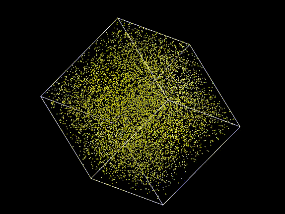

# Start

## Description

## Dependencies

- [C++20 Standard](https://www.google.com/url?sa=t&rct=j&q=&esrc=s&source=web&cd=&cad=rja&uact=8&ved=2ahUKEwiujKKht6CDAxVgQFUIHTKeCTcQFnoECAwQAQ&url=https%3A%2F%2Fen.cppreference.com%2Fw%2Fcpp%2F20&usg=AOvVaw0Ftu2-RonBEDSMhZLTiJqf&opi=89978449)
- [AABB](https://github.com/lohedges/aabbcc)
- [VMD](https://www.ks.uiuc.edu/Development/Download/download.cgi?PackageName=VMD)
- [Root CERN](https://root.cern/)
  > Do not forget also to install the [Root CERN dependencies](https://root.cern/install/dependencies/)

## Usage

### Example to compile(&start) the project

```bash
./compile.sh
```

or

```bash
./run.sh
```

### Example to visualize particles with the VMD

#### Simplest example

```cpp
int main()
{
    RealNumberGenerator rng;
    std::vector<Particle> particles(N);

    for (size_t i{}; i < N; ++i)
        particles[i] = Particle(rng.get_double(0, 100),
                                rng.get_double(0, 100),
                                rng.get_double(0, 100),
                                rng.get_double(0, 5),
                                rng.get_double(0, 5),
                                rng.get_double(0, 5),
                                rng.get_double(0.5, 1));

    for (size_t i{}; i < particles.size(); ++i)
    {
        const aabb::AABB &currentAABB{particles[i].getBoundingBox()};
        particles[i].updatePosition();
    }

    writeInXYZ(std::span<Particle const>(particles.data(), particles.size()), "trajectory.xyz");

    return EXIT_SUCCESS;
}
```

#### Compiling and running the simplest example

```bash
./compile.sh
./main
vmd trajectory.xyz -e vmd.tcl
```

#### Result


